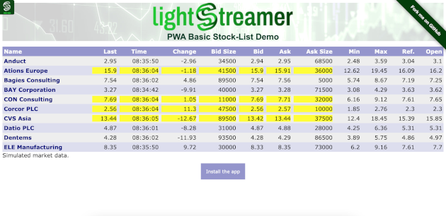

# Lightstreamer - Progressive Stock-List Demo - HTML Client

This demo adheres to the standards of [Progressive Web Apps (PWAs)](https://en.wikipedia.org/wiki/Progressive_web_application) to give users an experience similar to native apps.
PWAs provide a number of advantages, including being installable, responsively designed, network independent and secure.

### Live Demo

[](http://demos.lightstreamer.com/PWAStockListDemo/)

### [ View live demo](https://demos.lightstreamer.com/PWAStockListDemo/)

### Details

The demo displays real-time market data for ten stocks, generated by a feed simulator.<br>
This page uses the <b>JavaScript Client API for Lightstreamer</b> to handle the communications with Lightstreamer Server. A simple user interface is implemented to display the real-time data received from Lightstreamer Server.

The demo can be installed on the user device. The installation procedure varies from browser to browser. For example on Chrome an installation button should appear just below the stock table. Once installed, the demo runs in a standalone window instead of a browser tab and it is launchable from on the user's home screen, dock, taskbar, or shelf.

Like a native app the demo can run even if the user device is offline.<br>
Try to turn off the network connection: the demo reacts by landing in another page. When the network connection is enabled again, the demo goes back to the main page.

## Install

If you want to install the demo pointing to your local Lightstreamer Server, follow these steps:

* Note that, as prerequisite, the [Lightstreamer - Stock- List Demo - Java Adapter](https://github.com/Lightstreamer/Lightstreamer-example-Stocklist-adapter-java) has to be deployed on your local Lightstreamer Server instance. Please check out that project and follow the installation instructions provided with it.
* Launch Lightstreamer Server.

You can deploy the demo to use the Lightstreamer server as Web server or in any external Web Server you are running. 
If you choose the former case, please create the folders `<LS_HOME>/pages/PWAStockListDemo` then copy here the contents of the `src/PWAStockListDemo` folder of this project.<br>
The client demo configuration assumes that Lightstreamer Server is at address `https://push.lightstreamer.com`. If you need to target a different Lightstreamer server, for example `localhost`, please search this line:
```js
var lsClient = new LS.LightstreamerClient(protocolToUse+"//push.lightstreamer.com:"+portToUse,"DEMO");
```
in `app.js` and change it accordingly.<br>

The demo is now ready to be launched.

## See Also

### Lightstreamer Adapters Needed by These Demo Clients

* [Lightstreamer - Stock- List Demo - Java Adapter](https://github.com/Lightstreamer/Lightstreamer-example-Stocklist-adapter-java)

### Related Projects

* [Lightstreamer - Stock-List Demo with Web Push Notifications - HTML Clients](https://github.com/Lightstreamer/Lightstreamer-example-MPNStockList-client-javascript)
* [Lightstreamer - Stock-List Demos - HTML Clients](https://github.com/Lightstreamer/Lightstreamer-example-Stocklist-client-javascript)


## Lightstreamer Compatibility Notes

* Code compatible with Lightstreamer Web Client Library version 8.0.0 or newer.
* For Lightstreamer Server version 7.1 or greater.
